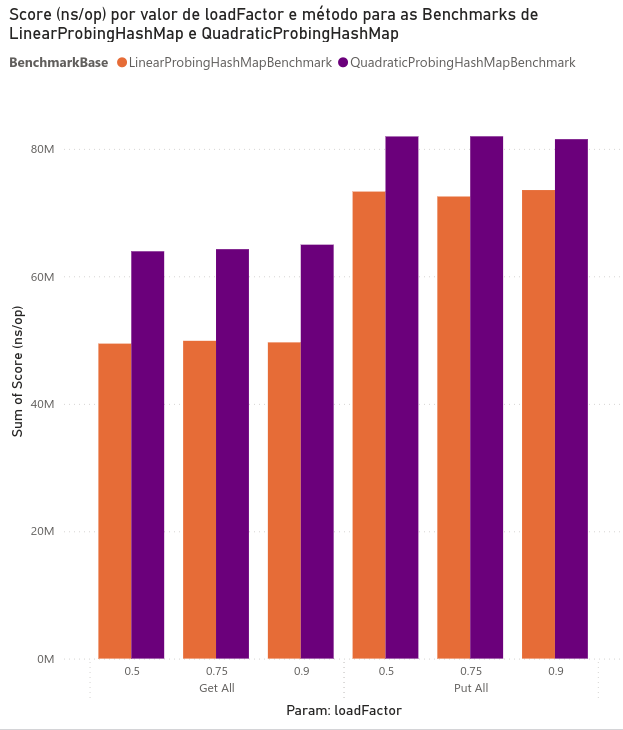
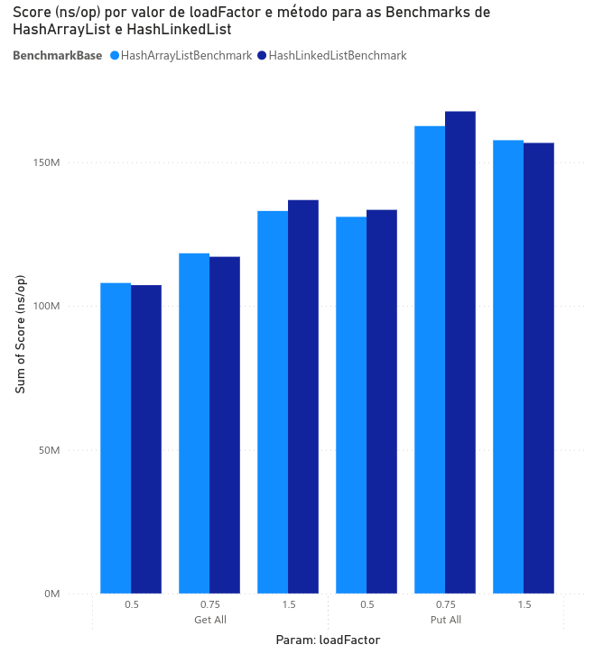

## eda-hashmap-analysis

Esse repositório contém a experimentação feita sobre a comparação de diferentes implementações de HashMap, com intuito de analisar diversas métricas sobre a eficiência de cada um. Os HashMap analisados são:
* Endereçamento Aberto com Sondagem Linear
* Endereçamento Aberto com Sondagem Quadrática
* Encadeamento Fechado com LinkedList
* Encadeamento Fechado com ArrayList

## Como rodar o experimento?
```
./run-benchmark.sh
```

## Metodologia

Esse experimento será conduzido em cinco etapas principais, correspondentes ao ciclo completo de preparação, execução e análise. O objetivo é avaliar a performance de diferentes estratégias de resolução de colisões em operações de inserção e busca em HashMap. Para isso, serão utilizadas quatro implementações distintas: endereçamento aberto com sondagem linear, endereçamento aberto com sondagem quadrática, encadeamento fechado com LinkedList e encadeamento fechado com ArrayList. Cada etapa foi definida de forma a garantir comparabilidade entre as implementações, possibilitando identificar em quais cenários cada estrutura apresenta maior eficiência.

### Configuração de etapa do plano de experimento:

- Configuração das estruturas

	Inicialmente, serão obtidos HashMaps do repositório Open Source thealgorithms, que serão devidamente alterados, para garantir que cada versão do HashMap esteja disponível para análise e possível modificação.


- Ambientação e configuração

	Após a recuperação, será realizada a adaptação das implementações para permitir a variação controlada do fator de carga em cada estrutura, assegurando comparabilidade entre os diferentes métodos de tratamento de colisões.


- Geração das entradas

	As entradas utilizadas nos experimentos serão geradas de maneira randômica, assegurando diversidade de casos de colisão. Essa abordagem garante que cada implementação seja testada sob condições variadas, simulando cenários próximos a aplicações reais.


- Execução dos testes com benchmarks
	
	Para a execução dos testes será utilizado um ambiente controlado, no qual serão aplicados benchmarks em Java, utilizando o JMH (Java Microbenchmark Harness), uma ferramenta de análise de desempenho projetada para medir e analisar o desempenho de código Java. Os testes permitirão a coleta de métricas relacionadas ao custo de memória e à eficiência das operações put e get. Cada cenário será repetido múltiplas vezes para reduzir a influência de outliers.


- Coleta e análise dos resultados

	Após a execução, os dados serão processados para permitir a comparação entre os cenários. Os dados obtidos durante a execução dos benchmarks serão registrados em arquivos de resultados. Em seguida, serão gerados gráficos comparativos que representarão o desempenho de cada variação de HashMap em relação às métricas coletadas. Por fim, os resultados serão analisados de forma crítica, buscando identificar padrões de comportamento e compreender em quais cenários cada técnica apresenta maior eficiência.

## Resultados do Estudo de Desempenho (Benchmarks)

--------------------------------------------------------------------------------
O objetivo desta análise é comparar a eficiência de quatro estruturas de dados em operações chave: recuperação de dados (getAll) e inserção de dados (putAll), sob diversas configurações de loadFactor. Os resultados são medidos em tempo de execução (ns/op).
<br>

1. **Métricas Chave e Dados Brutos**

>As estruturas de dados comparadas são: HashArrayList, HashLinkedList, LinearProbingHashMap, e QuadraticProbingHashMap.
A métrica principal é o Score (ns/op), onde valores menores indicam melhor desempenho. 
O loadFactor variou entre 0.5, 0.75, 0.9 e 1.5, dependendo do teste.
<br>


<table>
      <tr>
        <td></td>
        <td></td>
      </tr>
    </table>

2. **Análise de Desempenho por Operação**
    1. Desempenho de Recuperação 
    	> Esta seção avalia a rapidez com que a estrutura recupera todos os dados armazenados.

		|Estrutura|loadFactor|Score (ns/op)|
		|-----|------|-------|
		|LinearProbingHashMap|0.5|49.423.310,89|
		|LinearProbingHashMap|0.75|49.863.936,24|
		|LinearProbingHashMap|0.9|49.617.860,91|
		|QuadraticProbingHashMap|0.5|63.907.939,62|
		|QuadraticProbingHashMap|0.9|64.948.320,53|
		|HashArrayListBenchmark|0.5|107.964.315,5|
		|HashLinkedListBenchmark|1.5|136.800.778,8|

		#### Interpretação da Recuperação (getAll):
		* A LinearProbingHashMap é a estrutura mais rápida para recuperação, com scores consistentemente em torno de 49 milhões de ns/op.
		* As implementações baseadas em sondagem (LinearProbing e QuadraticProbing) são significativamente mais eficientes do que as baseadas em 	encadeamento (HashArrayList e HashLinkedList).
		* O pior desempenho foi observado na HashLinkedListBenchmark, atingindo 136.800.778,8 ns/op com loadFactor de 1.5.
	2. Desempenho de Inserção    
		> Esta seção avalia o custo de tempo para inserir todos os dados na estrutura.
    
		|Estrutura|loadFactor|Score (ns/op)|
		|-----|-----|-----|
		|LinearProbingHashMap|0.75|72.506.491,74|
		|LinearProbingHashMap|0.9|73.516.415,75|
		|QuadraticProbingHashMap|0.9|81.498.851,21|	
		|QuadraticProbingHashMap|0.75|81.949.619,83|	
		|HashArrayListBenchmark|0.75|162.519.794,9|	
		|HashLinkedListBenchmark|0.75|167.618.200,4|
			
		#### Interpretação da Inserção (putAll):
		* A LinearProbingHashMap mantém a liderança, com o melhor desempenho de inserção registrado em 72.506.491,74 ns/op (loadFactor 0.75).
		* A QuadraticProbingHashMap é a segunda melhor opção, com scores na faixa de 81 milhões de ns/op.
		* As implementações HashArrayList e HashLinkedList registraram os piores resultados. A HashLinkedList alcançou 167.618.200,4 ns/op (loadFactor 0.75), o custo de inserção mais alto em todos os testes.

	3. Impacto do Fator de Carga 
		> O impacto do loadFactor no desempenho varia conforme a implementação:
		* Estruturas de Sondagem (Probing): Para LinearProbingHashMap e QuadraticProbingHashMap, a variação do loadFactor (de 0.5 a 0.9) resultou em diferenças mínimas nos scores. O desempenho dessas estruturas é muito estável em diferentes níveis de ocupação.

		* Estruturas de Encandeamento (Hash): O desempenho é mais volátil.
			* No HashArrayList.getAll, o score aumentou de 107.964.315,5 ns/op (0.5) para 132.992.409,1 ns/op (1.5), indicando que o aumento do fator de carga penaliza a recuperação de dados quando listas encadeadas estão envolvidas.
   		 	* O HashLinkedList.putAll também mostrou uma degradação clara, indo de 133.382.830,1 ns/op (0.5) para 167.618.200,4 ns/op (0.75).

3. **Análise de Alocação de Memória (GC Metrics)**
    * As métricas de Garbage Collection (GC) indicam que a alocação de memória não foi um gargalo no desempenho medido:
        * O gc.count foi consistentemente 0.0 em todas as 23 medições de benchmark. Isso significa que não houve ciclos de coleta de lixo durante as operações cronometradas.
        * O gc.alloc.rate.norm (B/op), que mede a taxa normalizada de alocação de memória, permaneceu extremamente baixo e estável, variando apenas minimamente em torno de 0.0011 B/op em todos os testes.
4. **Conclusões e Recomendações**
    1. Melhor Escolha de Desempenho: A LinearProbingHashMap oferece o melhor desempenho geral, tanto para recuperação (getAll) quanto para inserção (putAll).
    2. Eficiência de Tempo: A ordem de eficiência decrescente é: LinearProbingHashMap > QuadraticProbingHashMap > HashArrayList/HashLinkedList.
    3. Robustez: As implementações baseadas em Sonda são mais robustas contra variações no loadFactor (até 0.9).
    4. Custo Operacional: As estruturas HashArrayList e HashLinkedList têm um custo operacional significativamente maior, especialmente com fatores de carga mais altos, o que sugere um overhead maior no gerenciamento de colisões via encadeamento.

## Relatório do experimento
Esse [_Relatório_](https://docs.google.com/document/d/1McAgqlTyzA-5fwfJNOPwc6OmLkhDPfAJob9Lm05y2U4/edit?tab=t.0) contém o processo de análise e os resultados.
